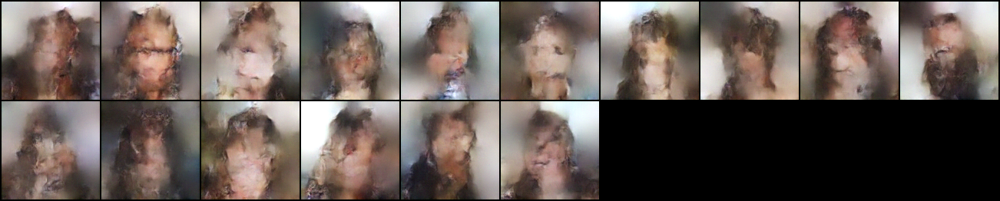
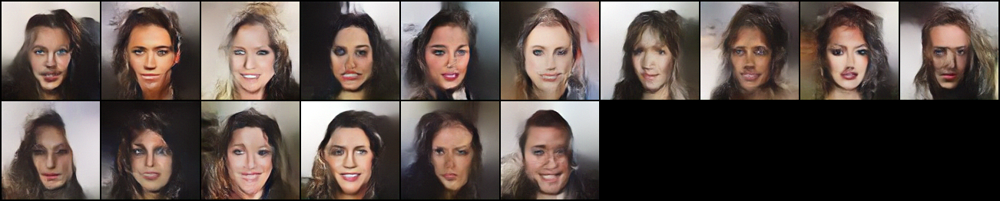
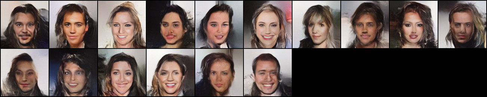
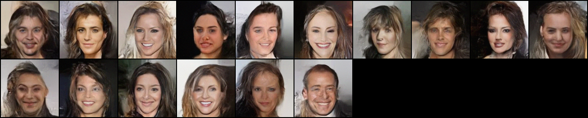

# Update log

### <07/12/2021(by Changyeop)>

TODO

1) Testing scale x4 after finishing scale x2
2) Splitting train/val for fair comparisons
3) Making independent test code
4) Implementing experiements with positive temperature

### <07/10/2021(by Changyeop)>

DONE

1) Removing conditional network (CN)
2) Temperature should be set 0 to preserve contents

TODO

1) Debugging the right glow for convergence
2) Adding skip-connection to use LR images
3) Not necessary to be bound by injector 
4) Due to the GPU memory, let's set n_flow=16 n_block=2 following the SRFlow

### PREVIOUS WORKS
  
1) Reproducing the FullGlow network
2) Training left glow first, and then training right glow
3) Adding transition layers referring to SRFlow (proved by training the left glow model -> work!)
4) Adding the affine injector reffering to SRFlow (not converge)


# Train command

## Training left glow
```bash
python train_onlyleft.py 'DATASET PATH'  --save_folder 'SAVING FOLDER NAME' --batch 'BATCH SIZE' --n_flow 'Num FLOWS' --n_block 'Num BLOCKS'
```
ex) python train_freezeleft.py './dataset' --save_folder 210710_test2 --batch 4 --n_flow 16 --n_block 2

## Training right glow
```bash
python train_freezeleft.py 'DATASET PATH'  --save_folder 'SAVING FOLDER NAME' --left_glow_params 'LEFT GLOW MODEL PATH' --temp 'TEMP' --batch 'BATCH' --n_flow 'Num FLOWS' --n_block 'Num BLOCKS'
```
ex) python train_freezeleft.py './dataset' --save_folder 210710_test2 --left_glow_params '' --temp 0 --batch 4 --n_flow 16 --n_block 2

# Recording areas

### [0713, Seungjae] Split 'train', 'valid', 'test'.
`train_freezeleft.py` now train with **train** set of CelebA dataset. Modified `sample_data` function which gets `split` variable.

### [0712, Seungjae] Conditioning after adding transition in left Glow (save_name=debug in 92 server)

There is a transition layer at each block in the architecture of SRFlow. We also added transition layer at each block and trained left Glow (LR). It did well. However, there was a minor bug when we come to the Glow with conditioning. The outputs from transition layer **does** needed in training the left Glow itself, but it **should not** be fed to the right Glow as conditioning variable. I modified the `prep_conds` function in the `model.py` to remove the output from transition layer in the conditioning variables (It is dictionary composed with lists). After that, `gen_hr` which is a direct reconstruction from HR images trained very fast (visually reasonable just in 201 iterations) as follows.

<p align="center">

</p>

### Get started

First of all, we will train the left Glow model without conditioning. You can train with `python train_onlyleft.py PATH_FOR_CELEBA --save_folder SAVE_PATH`.
Even with 200 iterations, reconstruction with encoded z from input images works well.
<p align="center">

</p>

With default hyperparameters, generated images from random z at several training iterations are as follows (really subjective).

<p align="center">

</p>

At 4,000 iterations, faces are coming.

<p align="center">

</p>

At 15,000 iterations, eyes are coming.

<p align="center">

</p>

At 30,000 iterations, eyes and fine details are coming.

<p align="center">

</p>

At 107,000 iterations..........
