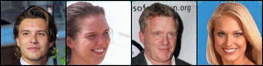

# Update log

### <07/26/2021(by Changyeop)>

DONE

1) Selecting the resizing method of conditional features (model.py, train_freezeleft_skip.py)

### <07/13/2021(by Changyeop)>

DISCUSSION

1) "HR size 192 -> NaN error, HR size 128 -> working" => Why?
2) Seungjae retrain left glow (size 32), and then train right glow (size 128, scale x4)

### <07/12/2021(by Changyeop)>

TODO

1) Testing scale x4 after finishing scale x2
2) Splitting train/val for fair comparisons
3) Making independent test code
4) Implementing experiements with positive temperature

### <07/10/2021(by Changyeop)>

DONE

1) Removing conditional network (CN)
2) Temperature should be set 0 to preserve contents

TODO

1) Debugging the right glow for convergence
2) Adding skip-connection to use LR images
3) Not necessary to be bound by injector 
4) Due to the GPU memory, let's set n_flow=16 n_block=2 following the SRFlow

### PREVIOUS WORKS
  
1) Reproducing the FullGlow network
2) Training left glow first, and then training right glow
3) Adding transition layers referring to SRFlow (proved by training the left glow model -> work!)
4) Adding the affine injector reffering to SRFlow (not converge)


# Train command

## Training left glow
```bash
python train_onlyleft.py 'DATASET PATH'  --save_folder 'SAVING FOLDER NAME' --batch 'BATCH SIZE' --n_flow 'Num FLOWS' --n_block 'Num BLOCKS'
```
ex) python train_onlyleft.py './dataset' --save_folder 210710_test2 --batch 4 --n_flow 16 --n_block 2

## Training right glow
```bash
python train_freezeleft.py 'DATASET PATH'  --save_folder 'SAVING FOLDER NAME' --left_glow_params 'LEFT GLOW MODEL PATH' --temp 'TEMP' --batch 'BATCH' --n_flow 'Num FLOWS' --n_block 'Num BLOCKS'
```
ex) python train_freezeleft.py './dataset' --save_folder 210710_test2 --left_glow_params '' --temp 0 --batch 4 --n_flow 16 --n_block 2

# Recording areas

### [0721, Seungjae] Hierarchical x4 SR
Direct x4 SR with `train_freezeleft.py` resulted some artifact.
Our hypothesis of these artifact is that they are from x4 interpolation of conditioning parameters.
Thus, we tried hierarchical x4 SR where images goes 32 --> 64 --> 128.
We first trained 32 --> 64 with `train_freezeleft.py`.
This pretrained right `Cond_Glow` will be `mid_Glow` in `train_freezeleft_freezemid.py`.
In `train_freezeleft_freezemid.py`, there are three Glows; Glow (with 32 size), Cond_Glow (with 64 size), and Cond_Glow (with 128 size).
We will load pretrained weights for left_Glow and mid_Glow.

`gen_hr_randz_randz_{str(i + 1).zfill(6)}.png` image is generated with following steps.
1. Extract conditioning parameters from left_Glow with 32 size image.
2. Generate `mr_randz` image. Random z is passed to reverse flow of mid_Glow conditioning with **1**.
3. Extract conditioning parameters from mid_Glow with `mr_randz` image (64 size).
4. Generate `hr_randz_randz` image. Random z is passed to reverse flow of right_Glow conditioning with **3**.

`mr` images are used in **training** right_Glow, but they are not used in generating `gen_hr_randz_randz_iter.png`.


`CUDA_VISIBLE_DEVICES=2,3 python train_freezeleft_freezemid.py ./celeba_train --save_folder 0720_x4_32_64_128_freezeleft_n_f_32_n_b_4 --scale 4 --img_size 128 --left_glow_params ./checkpoint/0713_x4_onlyleft_n_f_32_n_b_4_onceagain/model_lr_040001.pt --mid_glow_params ./checkpoint/0720_x2_32_64_freezeleft_n_f_32_n_b_4/model_hr_020001.pt`

### [0720, Seungjae] Revert to ImageFolder from CelebA dataset
No exact reason figured out, using CelebA dataset slows down the iteration which was adopted for train/valid/test split.
Reverted to ImageFolder and separated train/valid/test partition physically.
```bash
scp -r seungjae@143.248.230.92:/media/seungjae/4f8e1659-05ca-478b-993b-9eed84c6feaa/srdualglow/celeba_train ./
scp -r seungjae@143.248.230.92:/media/seungjae/4f8e1659-05ca-478b-993b-9eed84c6feaa/srdualglow/celeba_valid ./
scp -r seungjae@143.248.230.92:/media/seungjae/4f8e1659-05ca-478b-993b-9eed84c6feaa/srdualglow/celeba_test ./
```

### [0731, Seungjae] Trained SRFlow, Evaluation SRFlow.
Generated small test set from official test set of CelebA. Small test set is composed with first 350 images. You can get the dataset by following script.
`scp -r seungjae@143.248.230.92:/mnt/HDD3_coursework/srdualglow/celeba_small_test/_* ./`, password : `seungjae`.

Evaluation code is modified from official SRFlow test code. This code calculates PSNR, SSIM, LPIPS for each sample and save them as csv.
Evaluation code : `python SRFlow_seungjae/code/test_seungjae_SRFlow.py`

### [0713, Seungjae] For x4 SR.
Retrained Left Glow for x4 scale (32 --> 128).
`scp seungjae@143.248.230.92:/media/seungjae/4f8e1659-05ca-478b-993b-9eed84c6feaa/srdualglow/checkpoint/0713_x4_onlyleft_n_f_32_n_b_4_onceagain/model_lr_040001.pt ./`
password : `seungjae`
**[DEPRECATED]** `scp seungjae@143.248.230.92:/media/seungjae/4f8e1659-05ca-478b-993b-9eed84c6feaa/srdualglow/checkpoint/0713_x4_onlyleft_n_f_32_n_b_4/model_lr_010001.pt ./`

### [0713, Seungjae] Split 'train', 'valid', 'test'.
`train_freezeleft.py` now train with **train** set of CelebA dataset. Modified `sample_data` function which gets `split` variable.
**path argument has changed!!!** If you previously pass `path` argument as `./celeba`, now you have to pass as `.` (remove celeba at the end).

### [0712, Seungjae] Conditioning after adding transition in left Glow (save_name=debug in 92 server)

There is a transition layer at each block in the architecture of SRFlow. We also added transition layer at each block and trained left Glow (LR). It did well. However, there was a minor bug when we come to the Glow with conditioning. The outputs from transition layer **does** needed in training the left Glow itself, but it **should not** be fed to the right Glow as conditioning variable. I modified the `prep_conds` function in the `model.py` to remove the output from transition layer in the conditioning variables (It is dictionary composed with lists). After that, `gen_hr` which is a direct reconstruction from HR images trained very fast (visually reasonable just in 201 iterations) as follows.

<p align="center">

</p>

### Get started

First of all, we will train the left Glow model without conditioning. You can train with `python train_onlyleft.py PATH_FOR_CELEBA --save_folder SAVE_PATH`.
Even with 200 iterations, reconstruction with encoded z from input images works well.
<p align="center">

</p>

With default hyperparameters, generated images from random z at several training iterations are as follows (really subjective).

<p align="center">

</p>

At 4,000 iterations, faces are coming.

<p align="center">

</p>

At 15,000 iterations, eyes are coming.

<p align="center">

</p>

At 30,000 iterations, eyes and fine details are coming.

<p align="center">

</p>

At 107,000 iterations..........
